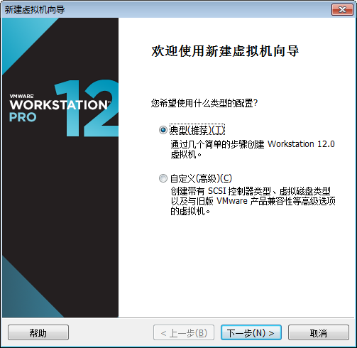
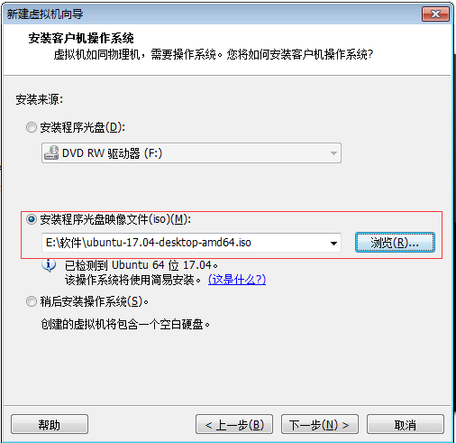
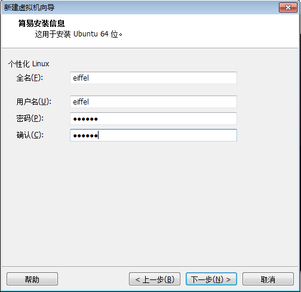
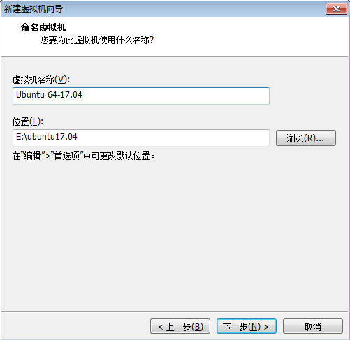
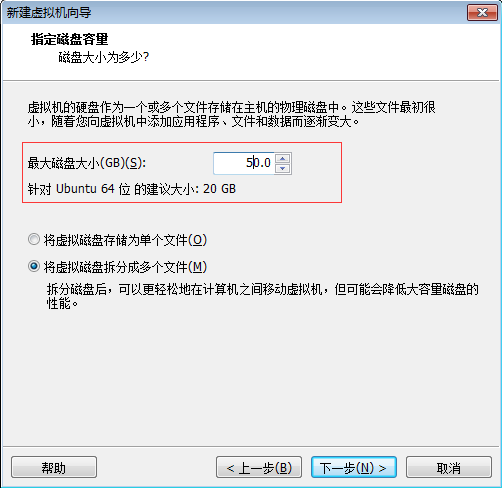
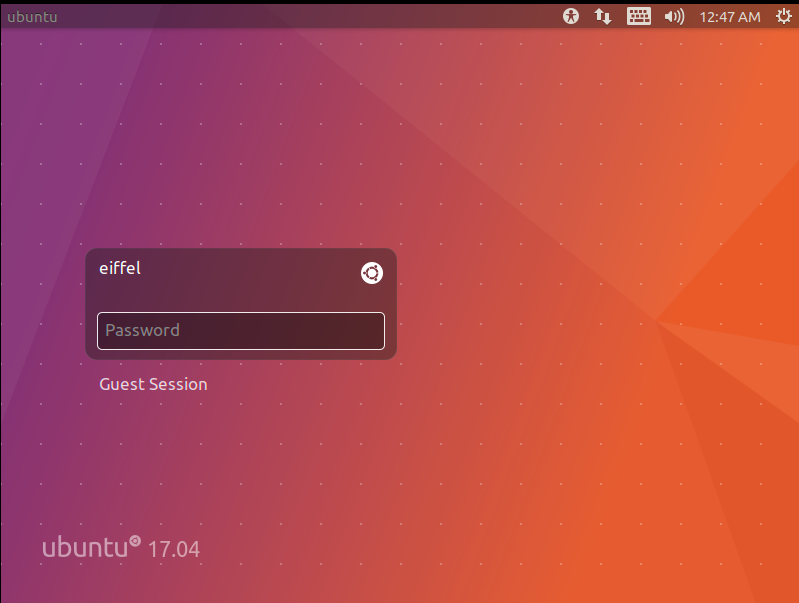
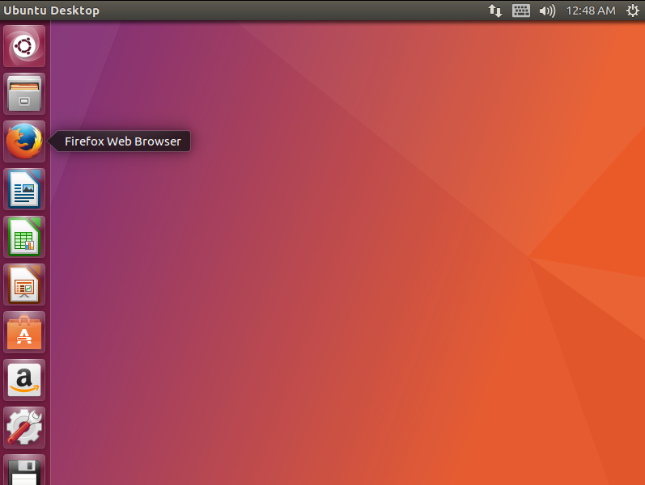

### 环境准备 
#### window7
#### 下载　VMware-workstation_full_12.2.0.1269.exe: 　[https://pan.baidu.com/s/1QLDz9LZboLcwvzsWSMuwXg](https://pan.baidu.com/s/1QLDz9LZboLcwvzsWSMuwXg "")
#### 下载　ubuntu-17.04-desktop-amd64.iso:　[https://pan.baidu.com/s/1HEd4IOXHRs4Ig3oAisvRXA](https://pan.baidu.com/s/1HEd4IOXHRs4Ig3oAisvRXA "")

#### 下载(建议使用18.04)　ubuntu-18.04.1-desktop-amd64.iso:　[https://pan.baidu.com/s/1Jyn8mZBSZtPRH8KjyburMA](https://pan.baidu.com/s/1Jyn8mZBSZtPRH8KjyburMA "")
#### 实验目标: 安装linux,　熟悉linux常用命令

## 1.     vmware 安装，选择默认安装即可

## ２.　打开vmware, 新建虚拟机


## ３.　选择下载的ubuntu-17.04-desktop-amd64.iso路径


## ４.　为虚拟机配置用户名，密码


## ５.　选择虚拟机安装位置


## ６.　配置硬盘


## ７.　等待安装完成，登录



## 8. linux 常用命令熟悉
```
vim
cat
tail
netstat
．．．．．．
```
