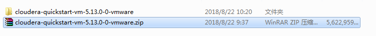
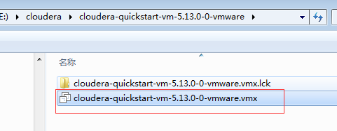
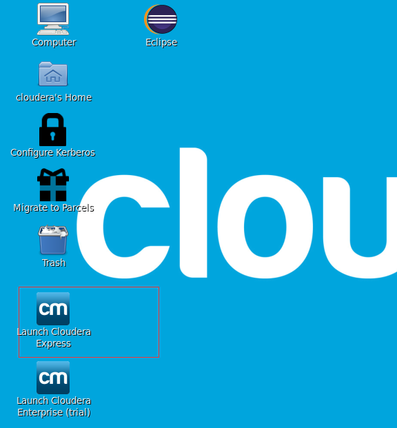

### 环境准备 
#### windows
#### 下载　VMware-workstation_full_12.2.0.1269.exe
#### 下载　cloudera-quickstart-vm-5.13.0-0-vmware.zip
#### 实验目标: 
##### 1. 学习集群运维工(cloudera Manager的使用）
##### 2.熟悉hadoop生态组件, 相关配置
##### 3.实际操作每个服务，了解服务的基本知识
##### 4. 参考: [https://www.cloudera.com](https://www.cloudera.com "")

## 1.     vmware 安装，选择默认安装即可


## ２.　解压　cloudera-quickstart-vm-5.13.0-0-vmware.zip


## ３.　打开vmware, 　选择文件－>打开，　选择虚拟机镜像


# ４.　等待启动，　安装完成　


## ５.　双击启动　cm


## 6.　浏览器登录

```
userName: cloudera
password: cloudera
```

## 8. 启动zookeeper、 hdfs、 hive、yarn、hue、sqoop

## 9. 自己熟悉一下每个服务的配置

