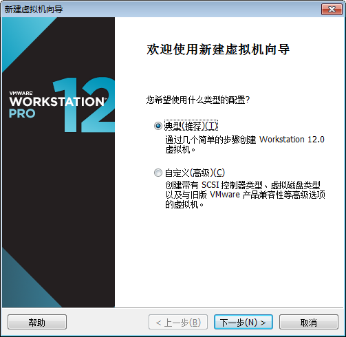

## 环境准备 
### window7
### 下载　VMware-workstation_full_12.2.0.1269.exe: 　[https://pan.baidu.com/s/1QLDz9LZboLcwvzsWSMuwXg](https://pan.baidu.com/s/1QLDz9LZboLcwvzsWSMuwXg "")
### 下载　ubuntu-17.04-desktop-amd64.iso:　[https://pan.baidu.com/s/1HEd4IOXHRs4Ig3oAisvRXA](https://pan.baidu.com/s/1HEd4IOXHRs4Ig3oAisvRXA "")

## 1.　新建虚拟机
